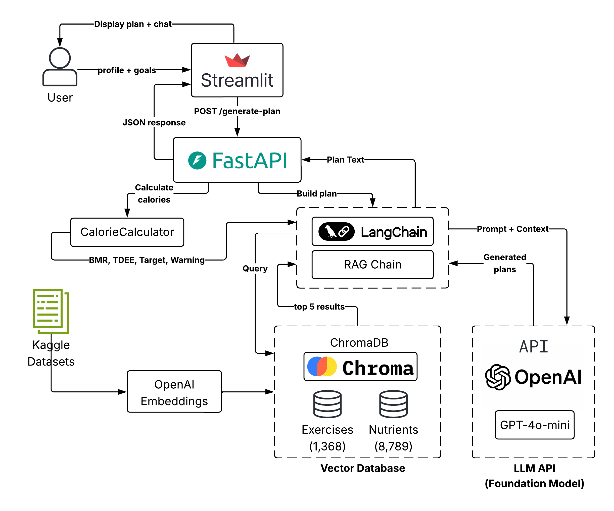

# FitBot - Your Personal Fitness Coach Bot

A RAG-based fitness and nutrition chatbot that generates personalized workout
and meal plans based on your body metrics, goals, and dietary preferences.

## Features

- Personalized calorie calculations using the Mifflin-St Jeor equation
- RAG-powered exercise and nutrition recommendations from real datasets
- Safety checks: 1200 kcal floor, BMI-aware goal validation, ED awareness
- Interactive chat to ask follow-up questions about your plan
- Six fitness goals: lose, aggressive lose, maintain, recomp, lean bulk, bulk

## Live Demo

Visit the deployed app: [FitBot on Hugging Face Spaces](https://huggingface.co/spaces/hanaessam/fitness-coach-bot)

## Run Locally

### Prerequisites

- Python 3.10+
- An OpenAI API key

### Setup

1. Clone the repository:

```bash
git clone https://github.com/hanaessam/fitness-coach-bot.git
cd fitness-coach-bot
```

2. Create and activate a virtual environment:

```bash
python3 -m venv venv
source venv/bin/activate
```

3. Install dependencies:

```bash
pip install -r requirements.txt
```

4. Create a `.env` file in the project root:

```
OPENAI_API_KEY=your_key_here
```

5. Download the datasets and place them in the `data/` folder:
   - [Gym Exercise Data](https://www.kaggle.com/datasets/niharika41298/gym-exercise-data) save as `data/megaGymDataset.csv`
   - [Nutritional Values for Common Foods](https://www.kaggle.com/datasets/trolukovich/nutritional-values-for-common-foods-and-products) save as `data/nutrition.csv`

6. Run data ingestion to populate ChromaDB:

```bash
python -m app.rag.ingest
```

7. Start the FastAPI backend:

```bash
uvicorn app.api:app --reload
```

8. In a separate terminal, start the Streamlit frontend:

```bash
streamlit run app/main.py
```

9. Open your browser to http://localhost:8501

## How to Use

1. Enter your body metrics in the sidebar (weight, height, age, sex)
2. Select your fitness goal, activity level, and dietary restrictions
3. Click "Generate My Plan"
4. Review your calorie summary, workout plan, and meal plan
5. Use the chat to ask follow-up questions or request modifications

## Architecture



## Tech Stack

- **Frontend**: Streamlit
- **Backend**: FastAPI
- **LLM**: OpenAI GPT-4o-mini
- **Embeddings**: OpenAI text-embedding-ada-002
- **Vector Store**: ChromaDB
- **Orchestration**: LangChain (LCEL)
- **Deployment**: Hugging Face Spaces (Docker)

## Project Structure

```
fitness-coach-bot/
├── app/
│   ├── main.py              # Streamlit frontend
│   ├── api.py               # FastAPI backend
│   ├── rag/
│   │   ├── ingest.py        # Data ingestion pipeline
│   │   ├── retriever.py     # ChromaDB query functions
│   │   └── chain.py         # LangChain RAG chain
│   ├── prompts/
│   │   └── system_prompt.py # FitBot system prompt
│   └── utils/
│       └── calorie_calc.py  # BMR/TDEE/safety calculations
├── data/                    # CSV datasets
├── chroma_db/               # Vector store (generated)
├── Dockerfile
├── start.sh
├── requirements.txt
└── README.md
```

## Datasets

- [Gym Exercise Data](https://www.kaggle.com/datasets/niharika41298/gym-exercise-data) by Niharika — 1,368 exercises after cleaning
- [Nutritional Values for Common Foods](https://www.kaggle.com/datasets/trolukovich/nutritional-values-for-common-foods-and-products) by Trolukovich — 8,789 food items

## Safety

FitBot enforces the following safety rules:

- Minimum 1200 kcal/day floor
- Blocks aggressive deficits for normal/underweight BMI users
- Refuses to diagnose injuries or medical conditions
- Always recommends consulting a healthcare professional
- Provides eating disorder helpline information when appropriate

